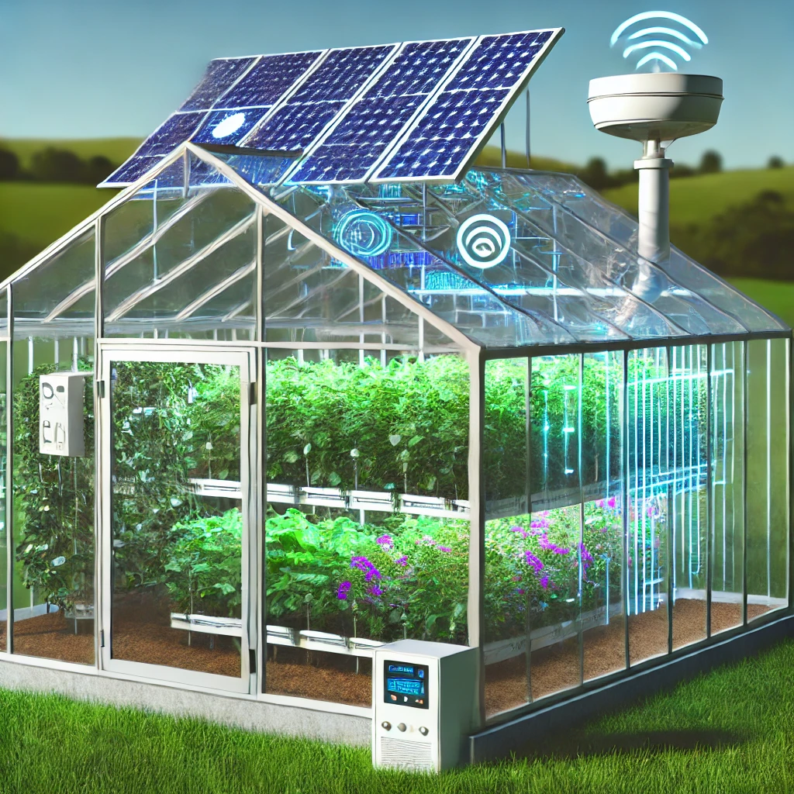
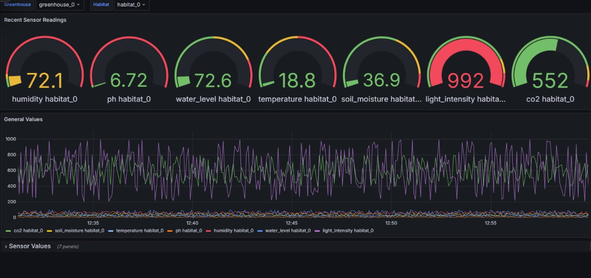

# Greenhouse Management System - Software Engineering for Internet of Things

The IoT-Based Greenhouse Management System is an innovative solution engineered to monitor and regulate environmental conditions within multiple greenhouses. Equipped with a variety of IoT sensors, the system continuously measures key parameters such as temperature, CO2 levels, light intensity, humidity, and soil moisture. The primary objective is to maintain optimal growing conditions, thereby enhancing plant health and productivity. This system allows for real-time data monitoring and the setting of customized thresholds tailored to the specific requirements of different plant species.




## Steps to Execute Project

1. **Install Docker Desktop**:
   - [Download Docker Desktop](https://www.docker.com/products/docker-desktop)
2. **Start Docker Desktop**:
   - Ensure Docker is running before you proceed.
3. **Set up the Project**:
   - Open the project config folder in the terminal
     ```
     cd GreenHouseIoT
     cd config
     ```
   - Execute the following commands sequentially:
     ```
     docker-compose build
     docker-compose up
     ```

## Technologies Used for Project Implementation

- **Python**: Utilized for generating synthetic datasets and backend logic.
- **Docker**: Employed for container orchestration to manage software dependencies easily.
- **Node-RED**: Used for developing the data flow and integration logic within the project.
- **Mosquitto**: Acts as the MQTT broker for reliable communication between the different project components.
- **InfluxDB**: Chosen for its time series data storage capabilities, ideal for environmental data.
- **Grafana**: Used for powerful data visualization, providing dashboards to visualize trends and real-time conditions.

## Data Visualization

The system leverages Grafana for its data visualization needs, providing a comprehensive dashboard that visualizes real-time data and historical trends. These visualizations help in quick decision-making and enhanced monitoring of the greenhouse environments.



---

## Developed by
- **Alaina Faisal**
- **Melissa Puerto Aguayo**
- **Sarosh Krishan**
